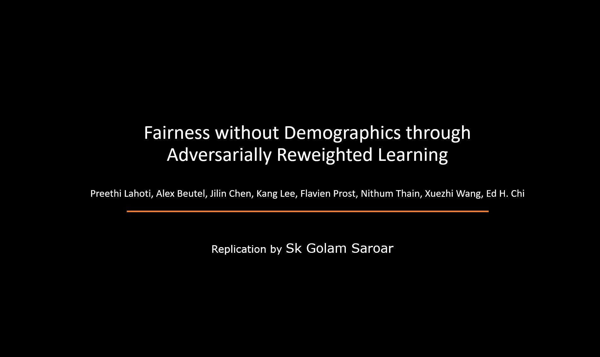
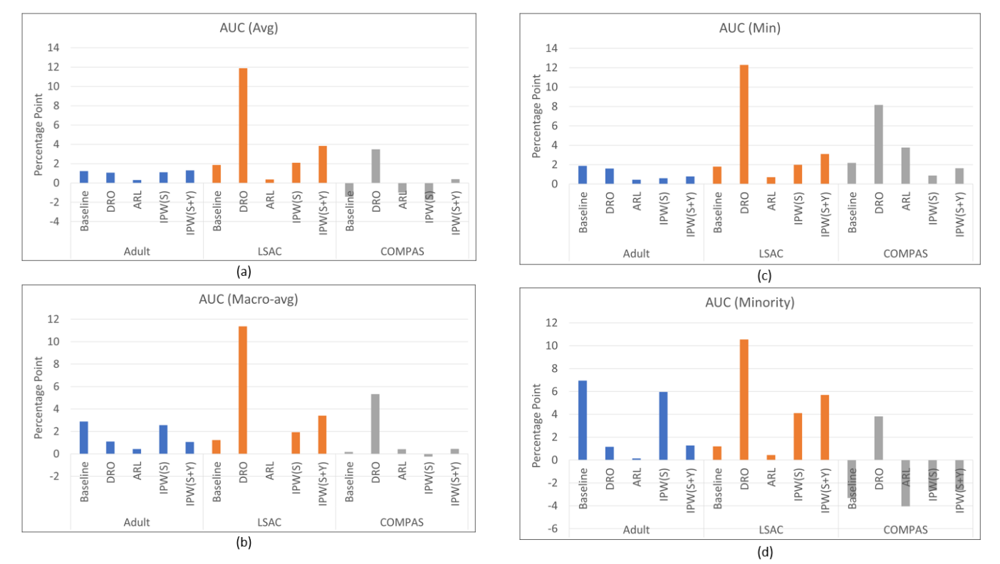

# Replication: Fairness without Demographics through Adversarially Reweighted Learning

This repository is a replication of the paper [Fairness without Demographics through Adversarially Reweighted Learning](https://arxiv.org/pdf/2006.13114v3.pdf). 



## Requirements

The easiest way to set up is creating a virtualenv and installing the requirements in it.  
Create a conda environment:

```
conda create --name myenv python=3.7
```

To install requirements:

```
pip install -r requirements.txt
```

## Project Structure

`/data`: contains the datasets used for the experiments  
`/data_preprocessing`: contains scripts for preprocessing the datasets  
`/models`: PyTorch implementation of all the models used in this study  

Additionally, a directory named `/grid_search` will be created when running the grid search. Also directory called 
`/training_logs` and `/lightning_logs` will be created everytime the program is run. These directories are added to 
`.gitignore`.

## Getting Datasets
I have created a simple bash script to download all three datasets and place them in the `/data` directory.
Simply run `fetch_data.sh` from the project root directory.

## Hyperparameter Tuning
To execute grid searches for all models and datasets with default settings, 
run the following command (I am using `8` because that's the number of CPUs in my computer):

```
python grid_search_hyperparams.py --num_workers 8
```

Once the grid search is complete, the optimal hyperparameters will be saved in JSON format in `hyper_parameters.json`.

>This command may take a long time to execute. It takes my computer around 15 hours to complete.

## Running

To get the replication results, run this command:

```
python replicate.py
```

This will train all the models, and store metrics (AUC and accuracy) for each (model, dataset) pair in `results.txt`.

## Insights into ARL

To get the predictive accuracy of ARL in identifying the protected groups, run the following:

```
python identifying_groups.py
```

The output will be stored in `ci.txt`. Also, run the following to check the example weights of the adversary:

```
python adversary_outputs.py
```

This will output a PDF named `ARL_learnt_weights.pdf`

## Results
The image below shows the percentage point difference in **(a)** Avg AUC and **(b)**
Macro-avg AUC **(c)** Minimum AUC  and **(d)** Minority AUC between my results and those reported in
the paper. 



For the complete list of results, please read [the report](report.pdf). 

## Replication Checklist

Below is the list of tasks for this replication and the section in the report where I have addressed each task:  

1. Preprocessing datasets following the steps mentioned
in the paper - Completed (section 2.2.2).
2. Implementing the proposed ARL approach - Completed
(section 2.1.1).
3. Implementing two baseline and one state-of-the-art approach to compare against ARL - Completed (section
2.1).
4. Evaluating and comparing ARL and the other approaches on the datasets - Completed (section 3.2,
3.3, 3.4).
5. Understanding ARL, presenting insights into the inner
working of ARL- Completed (section 3.5, 3.6)

> Thank You!